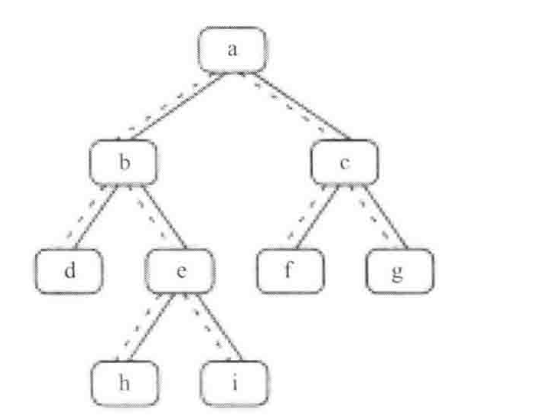

# 二叉树的下一个节点

## 信息卡片 

- 时间： 2019-08-15
- tag：二叉树

## 题目描述

给定一棵二叉树和其中的一个结点，如何找出中序遍历顺序的下一个结点？
树中的结点除了有两个分别指向左右子结点的指针以外，还有一个指向父结点的指针。


## 参考答案

1. 画一棵树如下：



其中：虚线表示节点指向父节点的指针

2. 思路

- 输入节点为`null`
- 输入节点左子节点
- 输入节点为右子节点
- 

```Java


```


## 总结（做题感受）

看到这道题目的时候，想着最为简单的方法就是把中序遍历的存起来，然后直接遍历结果就好。但直觉一般往
往是不靠谱的。后面就需要画个草图，举例子找出规律来。这是目前比较欠缺的一项技能。