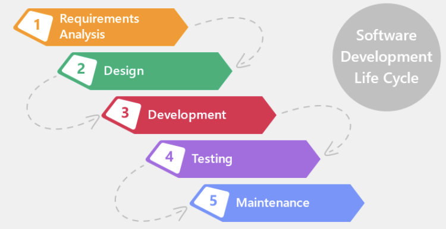
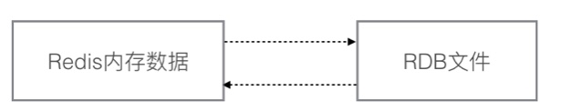

## ARTS之旅（22周）

### Algorithm

本周做的习题是[反转单链表](https://leetcode.com/problems/reverse-linked-list/)，题目比较简单，关键是把顺序弄对，画画草图。例子：

<pre>
Input: 1->2->3->4->5->NULL
Output: 5->4->3->2->1->NULL
</pre>

- 代码实现

```Java
 public ListNode reverseList(ListNode head) {
    if (null == head || null == head.next) {
        return head;
    }
    ListNode preNode = null;
    while (head != null) {
        ListNode nextNode = head.next;
        head.next = preNode;
        preNode = head;
        head = nextNode;
    }
    return preNode;
}
```

- 复杂度分析

    + 时间复杂度为 O(n), n为链表的长度
    + 空间复杂度: O(1)

---

### Review

本周阅读的英语文章

- 来源： Medium
- 标题：How to Become a Better Software Developer

作者从以下几个方面说明如何成为一个更好地开发者：

1. 了解开发流程，构建反馈路径

作者从软件开发周期角度说明：软件开发常常被对待成一些离散的、无反馈的步骤集，这种现象特别是在大公司，分工明确，每个部门或者组负责一部分。部门或者组之间的沟通反馈少。所以我们自己需要建立反馈



2. 离开你的舒适区，投入业务中，了解客户真正需求，才能提供更好的方案


3. 选择合适工具处理问题，而不是手头只有锤子，看任何东西都是钉子。

4. 多调研想关的技术和知识，而不是重复造轮子

5. 积极面对困难，而不是逃避

6. 关注基础


7. 不要成为责问她人的人，而是承担与分享


---

### Tip：暂缺

---

### Share: Redis持久化之RDB

很久之前就接触过Redis，但是一直未深入学习过。工作中也用了一段时间，但都是各种API调用罢了。上次看了
一下 `redis.conf`, 发现一个比较有趣的玩意， 然后就开始找资料看了相关的知识点，现在整理出来。

```Shell
save 60 1000
stop-writes-on-bgsave-error no
rdbcompression yes
dbfilename dump.rdb
```

#### 什么是RDB

RDB是Redis持久化的一种方式，它存储是某个时间点在内存中数据集的快照，以二进制的形式保存。 



#### 如何创建RDB以及RDB适用场景

+ 创建RDB文件的方式

    - 手动执行 `bgsave` 或者 `save` 命令
    - 配置项：`save time the_number_of_changed_data`
    - shutdown 命令
    - 在Redis主从复制机制中：RedisA 连接 RedisB，并发送 sync

+ 优缺点

|优点|缺点|  
|---|---|
|RDB数据文件简洁，恢复灵活，可以选择某个时间点的文件恢复   | 只能恢复最近时间点的数据，不适用于对数据敏感的应用 |   
|文件比较小，容易传输到其他服务恢复数据  | 当存储当前数据集大的时候使用save命令会导致应用停顿 |
| 相比于AOF方式，恢复数据快  |  - |

+ 选择RDB方式

    - 应用能否接受部分数据的丢失
    - save/bgsave在数据集比较大时，出现的停顿时间能否接受

#### RDB工作原理简介

- save命令创建RDB的工作步骤

    + Redis服务停止处理客户请求，处于阻塞状态
    + 将内存中数据集写入新的RDB文件
    + 重命名旧的RDB文件，并且Redis服务器恢复服务

- bgsave命令创建RDB的工作步骤
    
    + Redis服务器fork一个子进程
    + 子进程将当前内存中数据集写入到临时的RDB文件中
    + 子进程写完文件后，重命名旧的RDB文件

从上面可以看出：

- save命令会出现阻塞，毕竟是Redis服务进程处理的
- bgsave命令则不会，保存操作由子进程处理 

#### 参考资料

- [《Redis实战》](https://book.douban.com/subject/26612779/)
- [Redis Persistenc](https://redis.io/topics/persistence)
- [Redis persistence demystified](http://oldblog.antirez.com/post/redis-persistence-demystified.html)