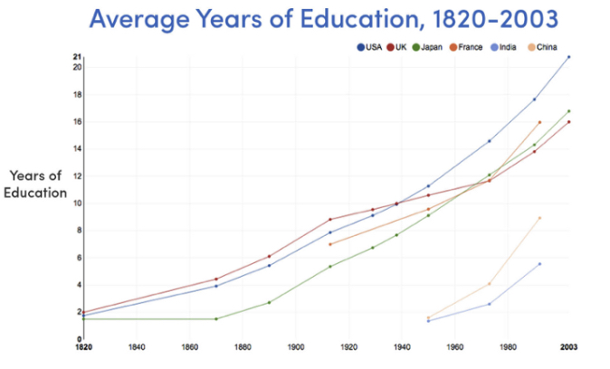

# ARTS之旅（24周）

现在主要的ARTS账务三个：

- 之前的ARTS都不没有补全;
- 之前的ARTS没有整理迁移过来；
- 目前TIP写的比较少，需要慢慢积累。

## Algorithm

本周做了两个算法题，都是比较简单地。本周的算法标签以及难度：

- tag： hash table
- level：easy

### 问题描述以及思路

1. [217. Contains Duplicate](https://leetcode.com/problems/contains-duplicate/)：给定两个字符串s和t，包含的字符串都是小写字母。其中t是s打乱之后的字符串，并在加入了一个字符。
请找出此字符出来。思路：开始想的是使用set方法做此题，后面想只有加入一个字符，两个字符串相减即可。

### 代码实现

```Java
public char findTheDifference(String s, String t) {
    if (null == s || null == t) {
        return '\0';
    }
    int sLen = s.length();
    int tLen = t.length();
    if (tLen < sLen || tLen - sLen != 1) {
        return '\0';
    }
    
    int diffChar = t.charAt(tLen - 1);
    for (int i = 0; i < sLen; ++i) {
        diffChar -= s.charAt(i);
        diffChar += t.charAt(i);
    }
    return (char) diffChar;
}
```

### 复杂度分析

+ 时间复杂度为 O(n), n为s的长度
+ 空间复杂度: O(1)

### 问题描述以及思路

2. [219. Contains Duplicate II](https://leetcode.com/problems/contains-duplicate-ii/)：给定一个整数数组arr和整数k，在arr是否存在 `arr[i]=arr[j], i != j`, 并且 `|i-j|i-j <= k`。

采用hashmap，存放的格式`<arr[i], i>`, 遍历数组，处理j时，若map中已经存在，且存在 `j-i <= k`则返回 `true`;若遍历完数组仍旧没有，则返回`false`。

### 代码实现

```Java
public boolean containsNearbyDuplicate(int[] nums, int k) {
    if (null == nums || nums.length == 0 || k <= 0 || k > nums.length) {
        return false;
    }
    Map<Integer, Integer> numsMap = new HashMap<Integer, Integer>();
    int len = nums.length;
    for (int i = 0; i < len; ++i) {
        if (numsMap.containsKey(nums[i])) {
            if (i - numsMap.get(nums[i]) <= k) {
                return true;
            }
        }
        numsMap.put(nums[i], i);
    }
    return false;
}
```

## 复杂度分析

+ 时间复杂度为 O(n), n为array的长度
+ 空间复杂度: O(n)

------------

##  Review

最近阅读的英语文章的主题都是5小时法则，所以将其整理，分享给大家。

### 5小时法则

#### 什么是5小时法则

 一周5小时法则，最早的来源是富兰克林那个家伙。5小时法则就是每天至少花1小时的时间来阅读或者刻意练习。
经过不断的积累，让自己慢慢成长，达到自己的目标。


### 为什么要5小时法则

1. 缘由
    * 所学的知识会不断的淘汰
    
    * 所处时代高学历的人越来越多，竞争更为激烈
    
    * 晋升需要
    

2. 很多领域大牛都使用5小时法则，下面就是例子：

    * Warren Buffett spends five to six hours per day reading five newspapers and 500 pages of corporate reports. 
    * Bill Gates reads 50 books per year. 
    * Mark Zuckerberg reads at least one book every two weeks. 
    * Elon Musk grew up reading two books a day, according to his brother.
    *  Oprah Winfrey credits books with much of her success: “Books were my pass to personal freedom.”
    *  Arthur Blank, co-founder of Home Depot, reads two hours day. 
    * Dan Gilbert, self-made billionaire and owner of the Cleveland Cavaliers, reads one to two hours a day.

### 如何应用5小时法则

1. 计划要学的知识
    * 需要完成的目标
    * 需要学习的知识
2. 刻意练习
    * 对自己需要诚实的反馈，然后不断改进。
3. 反思
    * 消化自己所学的
    * 散步或者与人交谈
4. 计划学习时间，阅读、交流和观察他人都可以
5. 问题一旦出现就去解决，切勿拖延
6. 做实验，验证自己的方法

### 粗浅思考

读完作者的一系列文章之后，比较同意作者说法。但作者没有说明我们现在所处的时代面对太多了诱惑了，注意力被很多外物所消费，比如电视剧。注意力被割裂不成样，几乎没有任何一块整体时间来学习或者阅读。所以若要保持不变，你都需要努力学习。若你一直呆在原地，那你就会落后，会变成温水煮青蛙。总之，不要偷懒，不要找借口，做就是了。

### 参考资料

- Why Constant Learners All Embrace the 5-Hour Rule
- Bill Gates, Warren Buffett And Oprah All Use The 5-Hour Rule
- The Math Behind The 5-Hour Rule: Why You Need To Learn 1 Hour Per Day Just To Stay Relevant
- 5-Hour Rule: If you’re not spending 5 hours per week learning, you’re being irresponsible

-------------

## Tip：暂缺

--------------

## Share：Redis中得LRU淘汰算法

### 概述

写了大量的业务代码，经常使用redis做缓存，但没有了解过，Redis作为缓存服务器时，若是设置了可用
内存的上限，会采用什么策略进行数据的删除。Redis中两种删除数据策略：

- LRU（Least recently used)

在redis4.0之前，使用了最近最少使用,如果数据最近被访问过，那么将来访问的几率很大，主要是程序的局部性原理。

- LFU（Least Frequently Used）

在Redis4.0引入了最不经常使用，如果一个数据在最近一段时间内使用次数很少，那么在将来一段时间内被使用的可能性
也很小。

设置缓存使用上限的，可以在`redis.conf`中使用 `maxmemory` 配置:`maxmemory 100mb`,注意在64bit中，默认是
有多少使用多少，而在32位系统中，最大可用内存为 **3GB**。

### 数据淘汰策略

当使用的内存到达配置的，需要选择不同策略进行处理，Redis采用如下策略进行数据淘汰：

- noeviction：客户端若要使用更多的内存，直接返回错误（主要是write）
- allkeys-lru: 将最近未使用key删除
- volatile-lru：在 expire 集合中，将最近未使用的key删除
- allkeys-random: 随机删除key
- volatile-random：在 expire 集合中随机删除key
- volatile-ttl： 在 expire 集合中，优先删除ttl 最短的key

使用 `maxmemory-policy` 进行配置即可,另外提一下就是`volatile-lru`, `volatile-random` 
和 `volatile-ttl` 使用策略的前提都是需要有expire集合，key有时效性的，若是没有满足的key，
就和`noeviction`策略一样。

### 如何选取剔除key的策略

1. 首选 allkeys-lru, 请求时幂律分布的或者你不确定的时候；
2. allkeys-random ：遍历key存在周期性或者均匀分布访问key
3. volatile-ttl： 若使用了时效性的key，可以选此策略’

### 近似的LRU算法

考虑到CPU的占用率，Redis并没有全局找出最近未使用的Key，而是采用近似的LRU算法，工作原理概述如下：

1. 根据配置的淘汰策略来抽取数据集中的数据，多少是由配置的采样样本值决定的
2. 然后从样本数据中删除最近未使用的key

选取删除key时，采样配置：`maxmemory-samples 5` 或者使用配置命令：`CONFIG SET maxmemory-samples <count>`

### LFU 模式

redis4.0版本引入一个新的淘汰算法模式：LFU（Least Frequently Used）,根据请求数据量，采用了近似计数器的算法计算key的使用数。
同样也是需要采样计数的。由于需要对大量key做计数采样，所以需要一定的延迟时间。

配置采样信息：

```
lfu-log-factor 10
lfu-decay-time 1
```

两种淘汰策略：

- `volatile-lfu`:在 expire集合中使用LFU算法，删除KEY
- `allkeys-lfu`: 对于所有的key，采用LFU算法

【TODO 看了两遍的Wikipedia，仍旧没看太明太明白，所以以后看懂在更新。】


### 参考资料

1. [Redis LRU](https://redis.io/topics/lru-cache)
2. [Morris counter](https://en.wikipedia.org/wiki/Approximate_counting_algorithm)

-------
