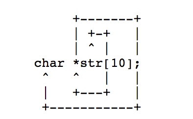
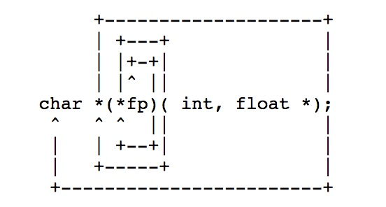
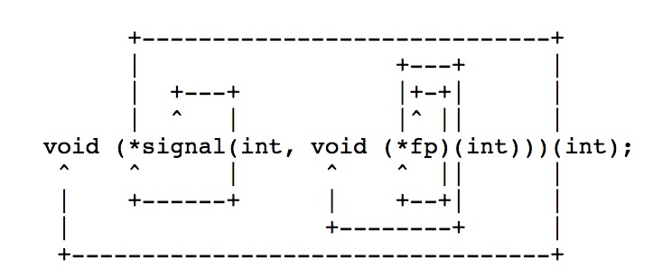

# 顺时针/旋转法则

- 标题：The `Clockwise/Spiral Rule`
- 作者：David Anderson

## 阅读笔记

此篇文章是讲了顺时针/旋转法则用于分析C函数声明。分三个步骤：

1. Starting with the unknown element, move in a spiral/clockwise direction; when ecountering the following elements replace them with the corresponding english statements:

    - `[X] or []` => Array X size of... or Array undefined size of...
    - `(type1, type2)`=> function passing type1 and type2 returning...
    - `*` => pointer(s) to...

2. Keep doing this in a spiral/clockwise direction until all tokens have been covered.

3. Always resolve anything in parenthesis first!

后面给了三个例子：

- 简单型

- 函数指针型

- 综合型

