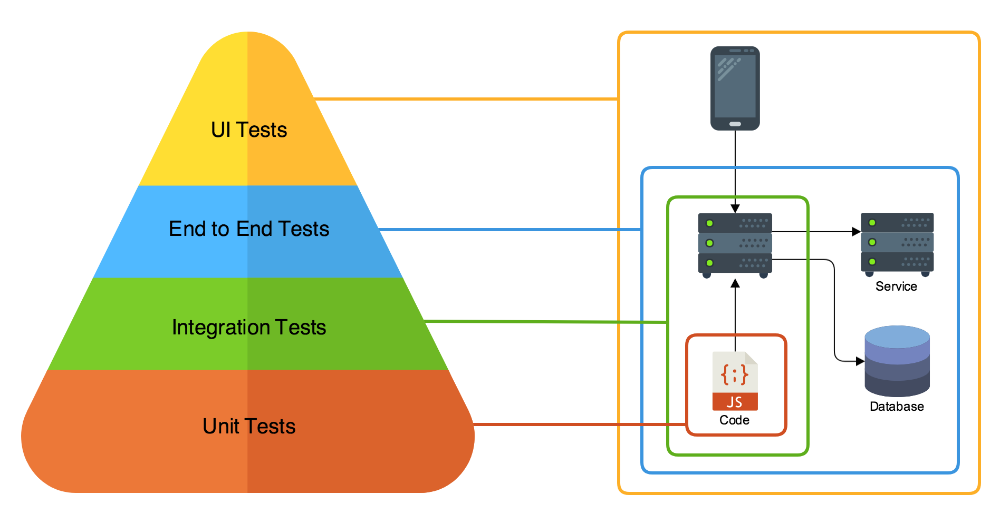
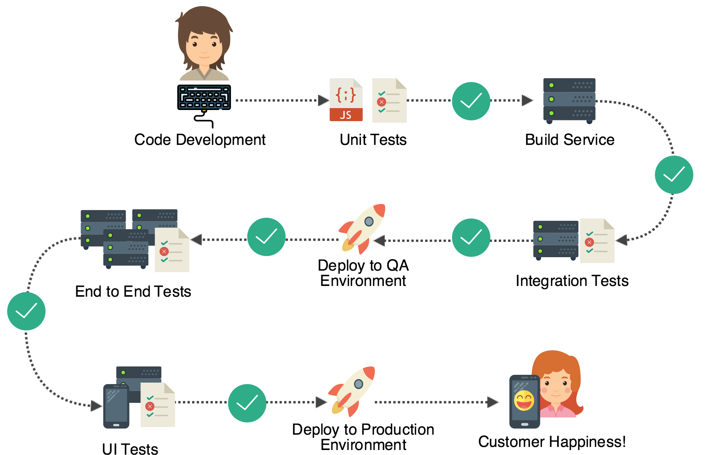

# 微服务测试简介

- 标题：microservice testing introduction
- 作者：nathankpeck

## 阅读笔记

### 金字塔模型

- 单元测试：验证服务内部的类方法或函数的行为
- 集成测试：验证服务的外部行为。
- 端到端测试：验证多个服务之间的交互行为。
- UI测试：验证整个平台的行为，不仅会测试客户端的逻辑，也会测试后端系统的逻辑，确保客户端和后端系统能够正常交互。

### 构建测试文化

* 开发人员必须认真对待，他们才是控制软件质量的关键所在；
* 测试必须集成到开发和发布中，一旦出现错误代码就停止发布：
    * 无法通过测试的代码不应该被合并到代码仓库里。
    * 无法通过测试的代码不应该被发布出去。
* 不要为了测试而测试，测试是为了交付一个高质量的软件给客户；

### 总结

为分布式系统创建一个完整的测试框架需要多层级别的测试，而不仅仅是UI测试。它包括：

* 单元测试：类和函数
* 集成测试：服务组件
* 端到端测试：整个系统
* UI测试：测试客户与整个系统的情况