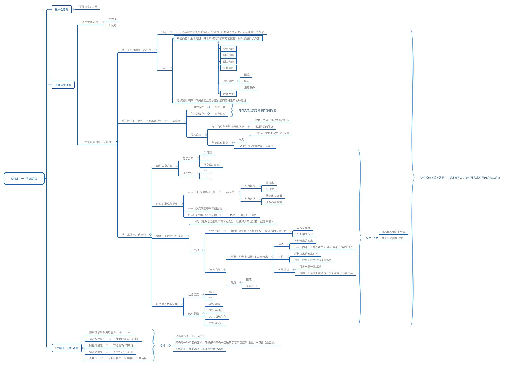

# 《如何设计秒杀系统》笔记

最近几天在撸《如何设计秒杀系统》，看完之后的体会：
1. 系统设计不是一触而就的，需要多个环节参与；
2. 秒杀系统设计4要1不要，这些原则都是围绕快（高性能）、准（数据一致性）、稳（高可用）三字而动，需要平衡抉择
3. 系统设计是平衡抉择的过程，也是一个团队，同样是集大量技术和理论地方。
4. 秒杀系统设计在工程方面很多trick和具体的技术是《如何设计秒杀系统》提及很少，更多是提出框架。

[清晰版](../image/如何设计一个秒杀系统.xmind)