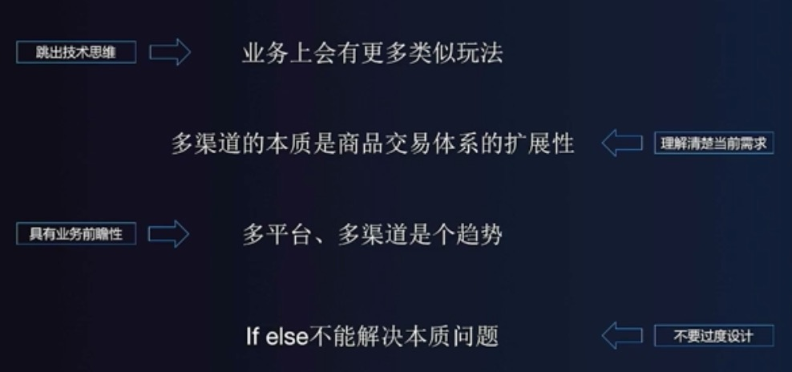
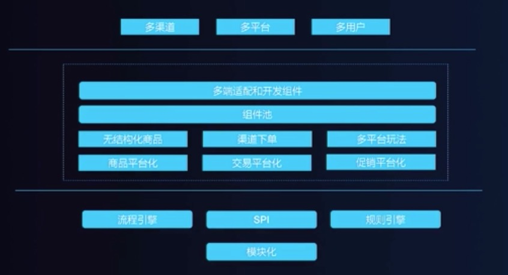

#《架构师的业务思维》笔记

## 什么叫业务思维

蘑菇街的陈辉老师的分享，站在业务角度，理解需求后，在去做需求，做架构设计。
那么什么是业务思维：站在业务方的视角，在理解业务发展目标、看清业务发展方向的前提下，做出技术和业务的平衡。因此架构师的职责就是打造一个稍稍跑在业务前面的架构，当跟不上业务角度的时候，思考一下是否要升级你的架构了。

## 怎样用业务思维影响架构设计

- 跳出技术思维：和业务对标
- 理解清楚当前需求
- 具有业务前瞻性
- 不要过度设计

## 如何培养业务思维

- 走到业务一线去：他们在做什么，他们的困惑在哪里，一线的状况实际情况到底是什么。发现真正的问题。
- 找对评判标准，比如客户价值
- 权衡技术和业务：对标业务，找到业务问题，再一一对应找到相关的技术方案。
- 看远一点，做实际点