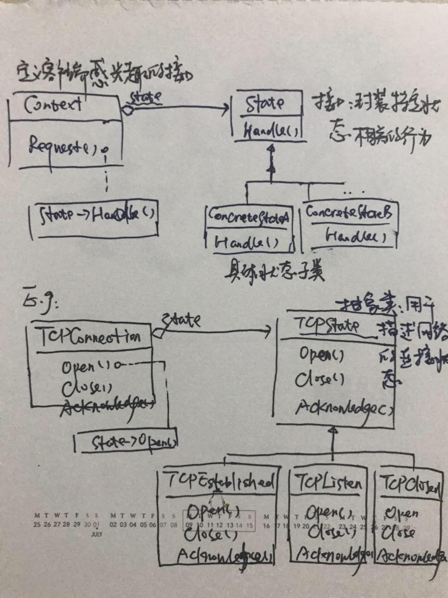

# 状态模式

## 概念

允许一个对象在其**内部状态改变**时改变它的**行为**。

## 适用性

- 一个对象的行为取决于它的状态，并且它必须在运行时刻根据状态改变它的行为。
- 一个操作中含有庞大的**多分支的条件语句，且这些分支依赖于该对象的状态**。

## 优缺点

### 优点

- 将与特定状态相关的行为局部化，并且将不同状态的行为分割开来。
【state模式提供了一个更好的方法来组织与特定状态相关的代码。决定状态转移的逻辑不在单块的if或switch语句中，而是分布在state子类之间。将每一个状态转换和动作封装到一个类中，就把着眼点从执行状态提高到整个对象的状态。从代码结构化并其意图更加清晰。】
- 状态转换显示化
- Sate状态可被共享

### 缺点

将不同的状态封装到多个state子类中，增加了子类的数量。

## 结构与例子

考虑一个表示网络连接的类`TCPConnection`，它的状态有：连接已建立、正在监听、连接已关闭。当一个TCPConnection对象收到其他对象的请求时，根据自身当前的状态做出不同的反应。

