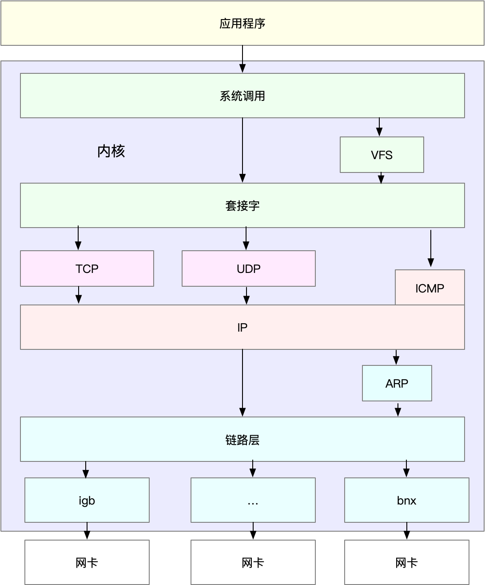

# 第六周：（2020.06.29~2020.07.05）| 深圳 2020.07.05

这周事情超级多，都是一些意外的事。看网络篇都是大概过了一遍，整个排查思路还是没有形成出来。
目前头脑中有的只是几个工具，但对于真正网络性能问题还是束手无措。看完整个网络篇，感触最深刻的一定要熟悉 网络协议层次、TCP协议的各种状态。还有一个就是两个节点通信的层次。都是分析网络问题的基础。

- 网络协议模型

- TCP 状态转换

- 节点间通信

总结：网络性能分析以及优化都是一层层排查以及优化的。