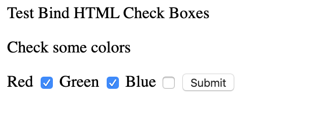

# 【Golang】Gin 框架之请求参数绑定

[TOC]

最近在用Gin来做一个side project，用于练手以及学习前端。看了Gin的文档，此文只是将相关的文档作为一个归类，留存起来。
首先我们看看，Gin中模型绑定和校验，是其他绑定类型请求的基础；后面再分别介绍Gin中相关的绑定类型（见下面的表）。

|             类型             |   重要程度   |
| :--------------------------: | :----------: |
|           绑定Url            |     重要     |
|   请求参数与自定义结构绑定   |     重要     |
| 请求参数是前端上送的CheckBox |     重要     |
|         仅仅绑定查询         | 一般，特殊化 |
|          绑定Header          |     一般  |
|   绑定查询类型或者POST数据   |     重要     |

## 模型绑定和校

模型绑定的作用是将请求体绑定到自定义类型，目前Gin支持：`JSON、XML、YAML和标准form请求参数(比如：foo=bar&boo=baz)`。
Gin使用`go-payground/validator/validtor/v10`，做参数的校验。若参数是必输，可以说明的使用 `binding:"required"`
修饰之。当在绑定的时候发现是空值就会返回错误。所以语法格式：

> \`绑定标签类型:"fieldname" binding:"required"\`

Gin提供两种类型的方法来实现绑定功能，并且在调用绑定方法的时候，会根据请求中头部`Content-Type`内容来调用相关的方法。
如果你确认绑定的参数类型，可以直接使用`MustBindWith` 或 `ShouldBindWith`，否则请使用`ShouldBind`作为万能钥匙。
下面具体看一下此两种类型：


|    类型     |   功能             |            方法          |         注意点       |
| :---------: | :------------------: | :--------------------: | :---------------: |
|  Must bind  | 调用钩子函数：`MustindWith`;绑定出现错误程序中断：`c.AbortWithError(400, err).SetType(ErrorTypeBind)`,效果就是返回`400`、`Content-Type:text.plain;charset=utf-8` |  `Bind, BindJSON, BindXML, BindQuery, BindYAML, BindHeader`      |      不够灵活     |
| Should bind |   调用钩子函数：`ShouldBindWith`     | `ShouldBind, ShouldBindJSON, ShouldBindXML, ShouldBindQuery, ShouldBindYAML, ShouldBindHeader` | 灵活，绑定错误需要客户自行处理 |

### 示例

```go
package main

import (
	"github.com/gin-gonic/gin"
	"net/http"
)

// Binding from JSON、form、xml
type Login struct {
	User string `form:"user" json:"user" xml:"user" binding:"required"`
	Password string `form:"password" json:"password" xml:"password" binding:"required"`
}


func loginFormHandler(c *gin.Context) {
	var form Login
	// This will infer what binder to use depending on the content-type header.
	if err := c.ShouldBind(&form); err != nil {
		c.JSON(http.StatusBadRequest, gin.H{"error": err.Error()})
		return
	}

	if form.User != "manu" || form.Password != "123" {
		c.JSON(http.StatusUnauthorized, gin.H{"status": "unauthorized"})
		return
	}

	c.JSON(http.StatusOK, gin.H{"status": "you are logged in"})
}

// Example for binding JSON ({"user": "manu", "password": "123"})
func loginJSONHandler(c *gin.Context)  {
	var json Login
	if err := c.ShouldBindJSON(&json); err != nil {
		c.JSON(http.StatusBadRequest, gin.H{
			"error":err.Error(),
		})
		return
	}
	if json.User != "manu" || json.Password != "123" {
		c.JSON(http.StatusUnauthorized, gin.H{
			"status":"unauthorized",
		})
		return
	}
	c.JSON(http.StatusOK, gin.H {
		"status":"you are logged in",
	})
}

// Example for binding XML (
//	<?xml version="1.0" encoding="UTF-8"?>
//	<root>
//		<user>user</user>
//		<password>123</password>
//	</root>)
func loginXMLHandler(c *gin.Context) {
	var xml Login
	if err := c.ShouldBindXML(&xml); err != nil {
		c.JSON(http.StatusBadRequest, gin.H{"error": err.Error()})
		return
	}

	if xml.User != "manu" || xml.Password != "123" {
		c.JSON(http.StatusUnauthorized, gin.H{"status": "unauthorized"})
		return
	}

	c.JSON(http.StatusOK, gin.H{"status": "you are logged in"})
}
func main() {
	router := gin.Default()
	router.POST("/loginJSON", loginJSONHandler)
	// Example for binding a HTML form (user=manu&password=123)
	router.POST("/loginForm", loginFormHandler)
	router.POST("/loginXML", loginXMLHandler)

	router.Run()
}
```

### 测试

|类型 | 测试命令 | 
|---------|----------|
|JSON |  `curl -X POST 'http://localhost:8080/loginJSON' -v -d '{"user":"manu", "password":"123"}'` |
|XML | `curl -X POST "http://localhost:8080/loginXML" -v -d '<?xml version="1.0" encoding="UTF-8"?><root><user>manu</user><password>123</password></root>'` |
|form | `curl -X POST "http://localhost:8080/loginForm" -v -d 'user=manu&password=123'`|
  

## 绑定Url

### 示例

此类型主要用在RESTful类型的接口，具体的示例代码如下：

```go
package main
// 绑定Uri
import "github.com/gin-gonic/gin"

func main() {
	route := gin.Default()
	route.GET("/:name/:id", func (c *gin.Context) {
		c.JSON(200, gin.H{
		"name": c.Param("name"),
		"uuid": c.Param("id"),
		})
	})
	route.Run()
}
```

### 测试

```shell
curl -X GET 'http://localhost:8080/yunfeng/12345'
{"name":"yunfeng","uuid":"12345"}
```

## 请求参数是前端上送的CheckBox

### 示例介绍

我们这里需要用到Gin一个静态资源绑定功能或者加载HTML功能。

```go
package main

import (
	"github.com/gin-gonic/gin"
	"net/http"
)

type myForm struct {
	Colors []string `form:"colors[]"`
}

func formHandler(c *gin.Context) {
	var fakeForm myForm
	// If `GET`, only `Form` binding engine (`query`) used.
	// If `POST`, first checks the `content-type` for `JSON` or `XML`, then uses `Form` (`form-data`)
	err := c.ShouldBind(&fakeForm)
	if err != nil {
		c.JSON(http.StatusBadRequest, gin.H{
			"error":err,
		})
	}
	c.JSON(http.StatusOK, gin.H{
		"color": fakeForm.Colors,
	})
}

func indexHandler(c *gin.Context) {
    // render form.html
	c.HTML(http.StatusOK, "form.html", nil)
}

func main() {
	router := gin.Default()

    // load html 
	router.LoadHTMLGlob("static/*")
	router.Static("/static", "./static")
	router.GET("/", indexHandler)
	router.POST("/testBindHtmlCheckboxes", formHandler)
	router.Run()
}
```

### 测试

1. 在命令行中： `go build -o bindHtml & ./bindHtml`

2. 在浏览器中输入：`http://localhost:8080/static/form.html` 或者 `http://localhost:8080`



3. 提交之后的结果：

- 浏览器上面的变为地址：`http://localhost:8080/testBindHtmlCheckboxes`
- 展示的信息：

    `{"color":["red","green"]}`


## 请求参数与自定义结构绑定

### 示例介绍

```go
package main

import "github.com/gin-gonic/gin"

// StructA 普通结构体
type StructA struct {
	FieldA string `form:"field_a"`
}

// StructB 嵌套型结构体
type StructB struct {
	NestedStruct StructA
	FieldB string `form:"field_b"`
}

// 嵌套结构指针
type StructC struct {
	NestedStructPointer *StructA
	FieldC string `form:"field_c"`
}

// 嵌套匿名类型
type StructD struct {
	NestedAnonyStruct struct {
		FieldX string `form:"field_x"`
	}
	FieldD string `form:"field_d"`
}

func GetDataB(c *gin.Context)  {
	var b StructB
	c.Bind(&b)
	c.JSON(200, gin.H {
		"a":b.NestedStruct,
		"b":b.FieldB,
	})
}

func GetDataC(c *gin.Context) {
	var b StructC
	c.Bind(fib)
	c.JSON(200, gin.H{
		"a":b.NestedStructPointer,
		"c":b.FieldC,
	})
}

func GetDataD(c *gin.Context) {
	var b StructD
	c.Bind(&b)
	c.JSON(200, gin.H{
		"x":b.NestedAnonyStruct,
		"d":b.FieldD,
	})
}

func main() {
	r := gin.Default()
	r.GET("/getb", GetDataB)
	r.GET("/getc", GetDataC)
	r.GET("/getd", GetDataD)

	r.Run()
}
```

```sh
curl "http://localhost:8080/getb?field_a=hello&field_b=world"
{"a":{"FieldA":"hello"},"b":"world"}

curl "http://localhost:8080/getc?field_a=hello&field_c=worldc&filed_x=helloX&filed_d=wordd"
{"a":{"FieldA":"hello"},"c":"worldc"}

curl "http://localhost:8080/getd?field_a=hello&field_c=worldc&field_x=helloX&field_d=wordd"
{"d":"wordd","x":{"FieldX":"helloX"}}
```

## 仅仅绑定查询

### 示例代码

```go
package main

import (
	"github.com/gin-gonic/gin"
	"net/http"
)

type Person struct {
	Name string `form:"name"`
	Address string `form:"address"`
}

func onlyBindQueryStringHandler(c *gin.Context) {
	var person Person
	if err := c.BindQuery(&person); err != nil {
		c.JSON(http.StatusBadRequest, gin.H{
			"error": err.Error(),
		})
		return
	}
	c.JSON(http.StatusOK, gin.H{
		"Name":person.Name,
		"address":person.Address,
	})
}

func main() {
	router := gin.Default()
	router.Any("/testOnlyBindQuery", onlyBindQueryStringHandler)
	router.Run()
}
```

### 测试

- 测试GET请求
    ` curl -X GET "localhost:8080/testOnlyBindQuery?name=yunfen&address=xyz"`

    > {"Name":"yunfen","address":"xyz"}

- 测试POST请求，发现请求体的数据忽略了
    `curl -X POST  "localhost:8080/testOnlyBindQuery?name=yunfen&address=xyz" -d "name=hhetest&address=ffff"`

    > {"Name":"yunfen","address":"xyz"}

## 绑定查询类型或者POST数据

### 示例

```go
package main

import (
	"github.com/gin-gonic/gin"
	"net/http"
	"time"
)

type Person struct {
	Name       string    `form:"name"`
	Address    string    `form:"address"`
	Birthday   time.Time `form:"birthday" time_format:"2006-01-02" time_utc:"1"`
	CreateTime time.Time `form:"createTime" time_format:"unixNano"`
	UnixTime   time.Time `form:"unixTime" time_format:"unix"`
}

func bindQueryStringOrPostDataHandler(c *gin.Context) {
	var person Person
	if err := c.ShouldBind(&person); err != nil {
		c.JSON(http.StatusBadRequest, gin.H {
			"error":err.Error(),
		})
		return
	}
	c.JSON(http.StatusOK, gin.H{
		"Name": person.Name,
		"Address": person.Address,
		"Birthday": person.Birthday,
		"CreateTime": person.CreateTime,
		"UnixTime": person.UnixTime,
	})
}

func main() {
	router := gin.Default()
	router.Any("/testQueryAndPost", bindQueryStringOrPostDataHandler)
	router.Run()
}
```

### 测试

- 测试GET请求

    `curl -X GET "localhost:8080/testQueryAndPost?name=appleboy&address=xyz&birthday=1992-03-15&createTime=1562400033000000123&unixTime=1562400033"`

    > {"Address":"xyz","Birthday":"1992-03-15T00:00:00Z","CreateTime":"2019-07-06T16:00:33.000000123+08:00","Name":"appleboy","UnixTime":"2019-07-06T16:00:33+08:00"}

- 测试POST请求
  
  `curl -X POST "localhost:8080/testQueryAndPost" -d "name=appleboy&address=xyz&birthday=1992-03-15&createTime=1562400033000000123&unixTime=1562400033"`

  
    > {"Address":"xyz","Birthday":"1992-03-15T00:00:00Z","CreateTime":"2019-07-06T16:00:33.000000123+08:00","Name":"appleboy","UnixTime":"2019-07-06T16:00:33+08:00"}

## 绑定Header

### 示例

```go
package main

import (
	"github.com/gin-gonic/gin"
	"net/http"
)

type DomainRate struct {
	Rate int `header:"Rate"`
	Domain string `header:"Domain"`
}

func bindHeaderHandler(c *gin.Context) {
	var header DomainRate
	if err := c.ShouldBindHeader(&header); err != nil {
		c.JSON(http.StatusBadRequest, gin.H{
			"status":err.Error(),
		})
		return
	}
	c.JSON(http.StatusOK, gin.H{
		"Rate":header.Rate,
		"Domain":header.Domain,
	})
}

// bind header
func main() {
	router := gin.Default()
	router.GET("/testBindHeader", bindHeaderHandler)
	router.Run()
}
```

### 测试

`curl -X GET "localhost:8080/testBindHeader" -H "rate":100 -H "domain":localhost`
> {"Domain":"localhost","Rate":100}

## 将请求body绑定到不同的结构

`JSON`、 `XML`、 `MsgPack`和`ProtoBuf`等格式请求体绑定，`ShouldBind`或者`ShouldBindWith`消费的
是`c.Request.Body`,会导致 **c.Request.Body**变成`EOF`。为此，`ShouldBindBodyWith`会在绑定之前
将请求体保存上下文中，但多少带来一定的性能损耗。若确定只绑定一次，就不要此方法。而其他格式的比如：`Query`、`Form`、`FormPost`和`FormMultipart`在多次使用`ShouldBind`绑定并不会消耗性能。

> // ShouldBindBodyWith is similar with ShouldBindWith, but it stores the request
// body into the context, and reuse when it is called again.
//
// NOTE: This method reads the body before binding. So you should use
// ShouldBindWith for better performance if you need to call only once.

### 例子

```go
package main

import (
	"github.com/gin-gonic/gin"
	"github.com/gin-gonic/gin/binding"
	"net/http"
)

type formA struct {
	Foo string `json:"foo"  binding:"required"`
}

type formB struct {
	Bar string `json:"bar" binding:"required"`
}

func usingShoudBindHandler(c *gin.Context) {
	objA := formA{}
	objB := formB{}
	// This c.ShouldBind consumes c.Request.Body and it cannot be reused.
	if errA := c.ShouldBindWith(&objA, binding.JSON); errA != nil {
		c.String(http.StatusBadRequest, "bind A JSON err:%s\n", errA.Error())
	} else if errB := c.ShouldBindWith(&objB, binding.JSON); errB != nil {
		// Always an error is occurred by this because c.Request.Body is EOF now.
		c.String(http.StatusBadRequest, "bind B JSON err:%s\n", errB.Error())
	}  else {
		c.String(http.StatusOK, "Foo:%s,Bar:%s\n", objA.Foo, objB.Bar)
	}
}


func usingShoudBindBodyWithHandler(c *gin.Context) {
	objA := formA{}
	objB := formB{}
	// This reads c.Request.Body and stores the result into the context.
	if errA := c.ShouldBindBodyWith(&objA, binding.JSON); errA != nil {
		c.String(http.StatusBadRequest, "bind A JSON err:%s\n", errA.Error())
	} else if errB := c.ShouldBindBodyWith(&objB, binding.JSON); errB != nil {
		// At this time, it reuses body stored in the context.
		c.String(http.StatusBadRequest, "bind B JSON err:%s\n", errB.Error())
	}  else {
		c.String(http.StatusOK, "Foo:%s,Bar:%s\n", objA.Foo, objB.Bar)
	}
}

func main() {
	router := gin.Default()
	router.POST("/testBodyDiffStr1", usingShoudBindHandler)
	router.POST("/testBodyDiffStr2", usingShoudBindBodyWithHandler)

	router.Run()
}
```

### 测试

`curl -X POST "localhost:8080/testBodyDiffStr1" -d '{"foo":"zdf", "bar":"test1"}'`

> bind B JSON err:EOF

`curl -X POST "localhost:8080/testBodyDiffStr2" -d '{"foo":"zdf", "bar":"test1"}'`

> Foo:zdf,Bar:test1